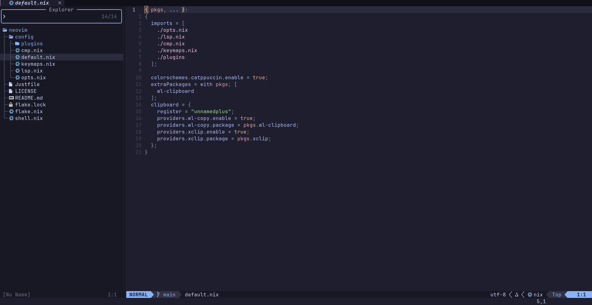

# My nixvim configuration 

Neovim the way i want it, declarative.



## How to run
```bash
nix run github:Superredstone/nixvim
```

## How to add to your configuration 
```nix
inputs.nixvim.url = "github:Superredstone/nixvim"
```

```nix
  environment = {
    systemPackages = with pkgs; [
      inputs.nixvim.packages.${system}.default
    ];
  };
```

